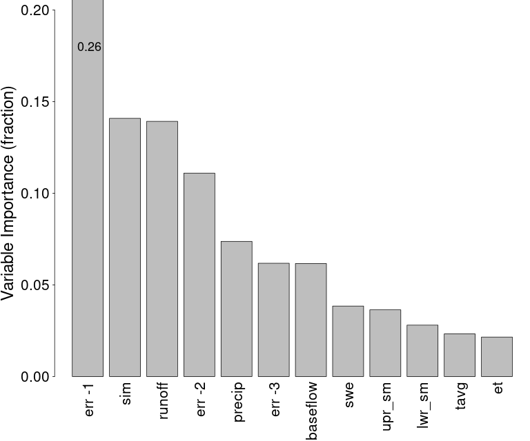
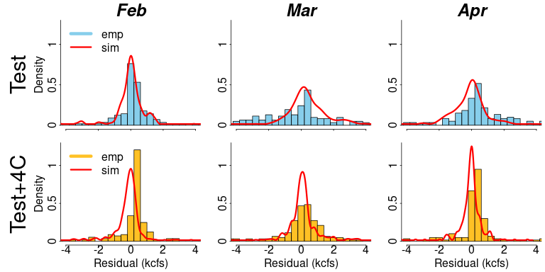
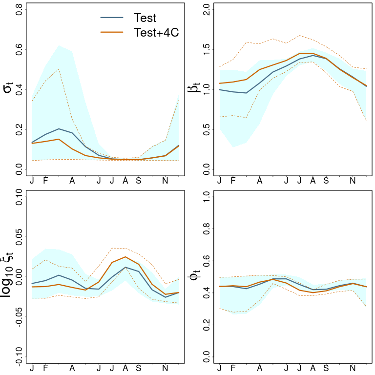

# hybrid-SWM training and familiarization
Overview: This file has some redundancy with the associated WaterProgramming blog post [here](https://waterprogramming.wordpress.com/2024/03/11/nonstationary-stochastic-watershed-modeling/). It is intended to
describe elements of the hybrid-SWM implementation in more detail than a surface-level implementation in the README file. The individual scripts are also heavily commented to describe the workings of each element of the model.   
### Overview of the GRRIEN repository structure
In the Steinschneider group, we cover elements of the GRRIEN repository setup as part of internal training [here](https://github.com/SteinschneiderLab/lab-manual/tree/main/training/open_research). See also Rohini's
blog post on the same [here](https://waterprogramming.wordpress.com/2023/03/06/introducing-the-grrien-analysis-framework-defining-standards-for-reproducible-and-robust-supervised-learning-of-earth-surface-processes-at-large-spatial-scales/), which describe Elizabeth Carter's paper (Syracuse University, former Steinschneider Group member) that formalizes this method.

#### _GRRIEN repository_   
   
The README file and structure of this repository has been constructed to follow closely with this GRRIEN structure, excepting some elements that are more appropriate for large geospatial data problems. As noted in the group training on this subject, this is one of many possible formulations of a good repository structure and useful as a starting point to build out your own preferred approach.
### Data processing
The data processing for the hybrid SWM (data_process.R) is relatively straightforward. This script simply tidies up the state-variable and simulation timeseries files from the raw_data folder and calculates lag-1 to 3 errors for fitting the Random Forest (RF) error correction model. The data generation via the hydrologic models (SAC-SMA and HYMOD) for the Feather River at Oroville (ORO) site used for this example is not covered in detail in this training. You can consult the manuscript and supporting information files associated with this training for more details on the actual setup and optimization of the hydrologic models, which was all done by Sungwook Wi. The specifics of this are not super important to the main idea. What is important is the setup of the 'model-as-truth' experimental design used to generate these data. See the associated blog post for a high-level description of this approach. The figures showing the study watershed and describing the experimental design are shown below for convenience:
   
#### _Study area_      
   

#### _Model-as-truth experimental design_   
### Model fitting
Fitting of the hybrid-SWM is done via a staged, two-step process. The first step is an error correction model that is fit as a predictive model between the state-variables and the raw predictive errors, including lag-1 to 3 errors to account for autocorrelation. The second step is a dynamic residual model (DRM) that is a time-varying, state-variable dependent distributional model for the residuals of the error correction step. We'll go through the steps in more detail below with reference to the 'model_train.R' script. Here is the figure from the manuscript describing the model fitting procedure for reference:

#### _Hybrid-SWM_  

### Random Forest error correction model
As mentioned in the model fitting section, the error correction model is simply a predictive model between the state-variables and the raw errors. We implement this step using a Random Forest (RF) model, due to their robustness to overfitting. RF models are a relatively early ML technique that leverage an original methodology called Classification and Regression Trees (CART). Fitting of individual CART trees IS prone to overfitting, but RF builds and ensemble of trees using a few randomization techniques (bagging, random feature selection). The output of the RF is the 'majority vote' of the ensemble of trees and coupled with the other randomization techniques, prevents overfitting to the training data. See Rohini's post [here](https://waterprogramming.wordpress.com/2019/02/04/intro-to-machine-learning-part-5-bagging/) for further details.

#### _Random Forest_  

Importantly, the RF error correction model is fitted to a calibration subset of the training data, leaving the validation subset for fitting of the DRM. To interpret variable importance, we can use the output of the fitted RF model directly, which calculated feature importance aggregated over all the trees in the ensemble. This output is described in more detail in the 'RF variable importance' figure and text below.   
   
We can also employ LIME (Local, Interpretable, Model-agnostic Explanation) as a form of explainable AI (xAI) to the fitted RF model to understand local feature importance, down to the granularity of individual timesteps. [Here](docs/LIME.pdf) is a short pictorial depiction of LIME. We describe the LIME procedure as implemented in this work ('lime' package in R) in the associated section below.

### Dynamic residual model (DRM)
The DRM is a little bit methodologically dense. It embeds linear models for all the parameters of a distribution, the skew exponential power (SEP) distribution, inside a log-likelihood function that can be maximized against the empirical residuals in the validation subset after RF error correction. This allows the DRM to capture 'out-of-sample' residual uncertainty and time-varying, state-variable dependent properties of those residuals. We employ a noise regularization technique to the MLE procedure that helps smooth out the estimation of the coefficients against the data. As noted, the SEP distribution is the heart of this model and most importantly, the parameterizations for kurtosis ($\beta$) and skewness ($\xi$) shown . What this means practically is that the result of the DRM fitting procedure ('model_train.R') yields a set of coefficients (9 state-variable coefficients + 1 intercept) for each SEP parameter's linear model. So there is a state-variable dependent linear model for the stdev term $\sigma_t$, a linear model for the kurtosis parameter $\beta_t$, etc. Importantly, there is no model for the mean $\mu$ because the residuals are assumed to be debiased by the error correction procedure. Thus, given any timeseries of state-variables, the fitted linear models will generate a timeseries of the 4 parameters of the DRM ($\sigma_t, \beta_t, \xi_t, \phi_t$). Functionally, this means that generation of new residual at time = $t$ is a random sample from the $SEP(0,\sigma_t,\beta_t,\xi_t)$ modified by the residual at $t-1$  ($\epsilon_{t-1}$) through the $\phi_t$ lag-1 autocorrelation term.  

#### _SEP distribution_  

## Code implementation
This is all quite a lot to parse. Let's take a look at the code implementation, which may clarify some of these higher level descriptions. The model scripts included in this repo have been commented quite extensively, so I'll just try to highlight key sections of the code to explain what they are doing.   
### data_process
As noted above, the data processing part of the procedure is not super hard to follow. The script is just downloading the raw data, applying labels to it, and doing some simple offsetting to establish lag 0 to lag 3 versions of all state-variables and the error timeseries. The state variables used for HYMOD are shown in the table below. The matrix output by the data-processing script is repeated from lag 0 to lag 3, but the only lagged information used in the actual modeling is the lag 1 to 3 errors. Note how the errors are defined in the script as the 'truth' model minus the 'process' model outputs (L66-71).

#### _State variables_ 
### model_train
This script fits both the RF error correction model and the DRM. Up until L35, the script sets up the date/time indices for the calibration, validation, and test periods and organizes the predictor matrices for both the RF error correction (all lag 0 state variables + lag 1:3 errors) and the DRM (all lag 0 state variables. The actual fitting of the RF error correction model requires only one line of code on L42 from the 'ranger' package. There is no hyperparameter selection for the RF model as we found it not to be super helpful, so the RF model uses the default settings of 500 trees and $\sqrt{K}$ for the random feature selection parameter 'mtry'. This model is fit on the calibration subset of the training data and then in L48-56, the RF model is used to debias the errors of the validation set for fitting of the DRM.   

Fitting of the DRM model takes up a bit more of the script than the RF model. L65-94 define the bounded constraints for the optimization problem. While $\beta_t$ and $\log_{10}(\xi_t)$ can take values relatively symmetric about zero, the $\sigma_t$ and $\phi_t$ should be positive and no greater than 1 for $\phi_t$. Most notably, we found that constraining all linear coefficients for $\sigma_t$ to be > 0  and also setting the minimum intercept to the lowest decile of the $\abs{\epsilon_t}$ ensured stability and achieved good MLE solutions. L96-112 deal with normalization of the predictors, where predictors are scaled and centered for $\beta_t, \xi_t$, but scaled and referenced to a minimum value of zero for $\sigma_t, \phi_t$. This specific setup was somewhat undesirable from an ease of implementation standpoint, but enabled more stable and consistent MLE results.
   

#### _DRM functions_ 

#### _Error correction residuals_  

### RF variable importance figure (Figure 6)
This is the variable importance data output directly from the RF implementation used in this work ('ranger' package in R). This 

#### _RF variable importance_  

Below is the result of the LIME procedure applied to subsets of the data to accentuate features that contribute most to inferring changing biases between the Test and Test+4C scenarios.   

#### _LIME_  

The application of the DRM is shown for the same periods, demonstrating its ability to adapt in the Test and Test+4C case.  

#### _Fitted DRM result_  
   
Finally, interpretability of the model can be relatively easily accomplished looking at properties of the parameters, such as their seasonality.

#### _DRM parameter seasonality_  

Comparison of the hybrid SWM to a 'static' approach noting the inability of the static model to emulate changes in the Test+4C period.

#### _Hybrid SWM vs static SWM_  

Timeseries plot in 2011 showing implications of shifts in biases between Test and Test+4C case. Of note during snowmelt periods and flow recession.

#### _Hybrid SWM timeseries plot_  

Comparison of hybrid SWM and static SWM in terms of emulating extreme high and low flows in Test and Test+4C.

#### _Hybrid SWM vs static SWM - high/low flow extremes_ 
